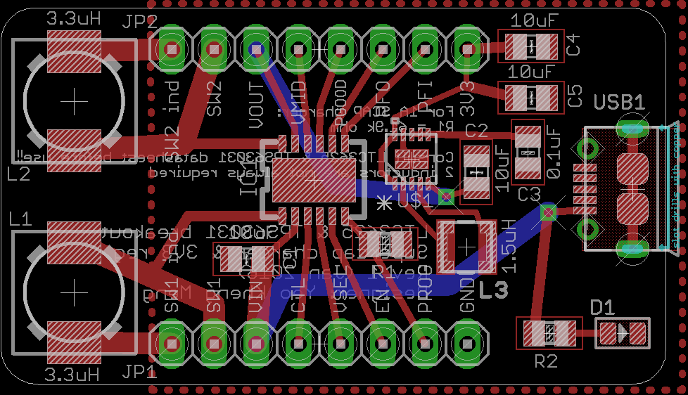
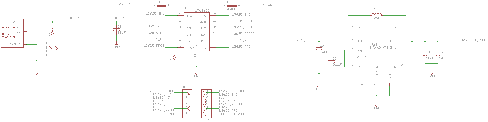

# pcb-breakout-ltc3625-tps63031
Pin breakout of the LTC3625 supercapacitor charger with TPS63031 3.3V regulator to through-hole pin headers for prototyping

<b>WARNING</b>: Consult the LTC3625 and TPS63031 datasheets in conjunction with the Eagle schematic to learn proper usage of this breakout.

If your project uses low currents it might be better enable power-save mode by setting the power save (PS) pin 7 of the TPS63031 to ground.

##PCB Design software and addons used

1. Eagle 7.5.0: I use Standard but Light should still be able to open/modify the files.
2. My custom ltc3625 library
3. [Seed-OPL-Connector](http://www.seeedstudio.com/wiki/File:OPL_eagle_library.zip)
4. [Coilcraft inductor](https://github.com/robertstarr/lbr_user/blob/master/inductor-coilcraft.lbr)
5. [TPS63031](http://e2e.ti.com/support/development_tools/webench_design_center/f/234/p/379556/1338022)

##Images
None at this time

##Schematic drawings
Images are exported from Eagle at 600dpi.

##Parts required
1. Linear Technology LTC3625
2. Texas Instruments TPS63031
3. 4x 10uF 0805 ceramic capacitors
4. 0.1uF 0805 ceramic capacitor
5. 2x 3.3uH DR73 inductors
6. 0805 resistor for LED
7. 0805 LED
8. 2x 8-pin through-hole pin headers
9. Hirose ZX62D-B-5PA8 micro-USB connector
